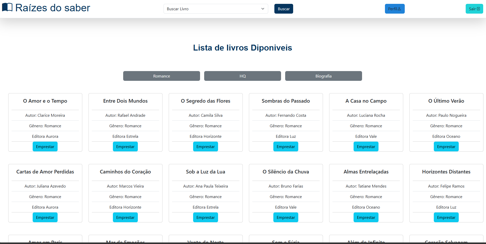
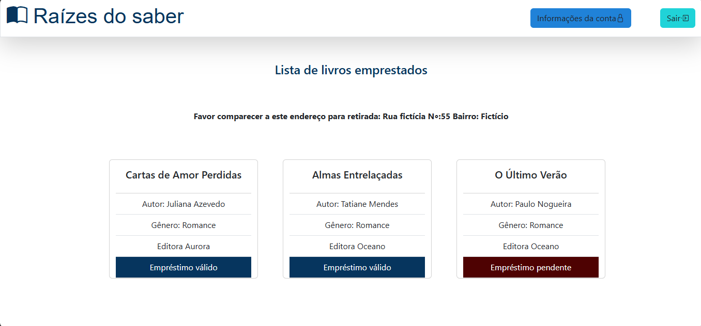
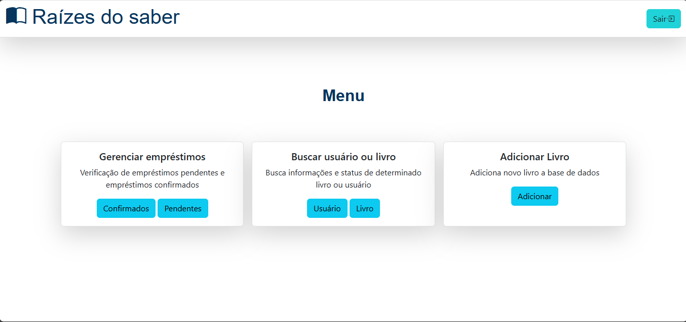
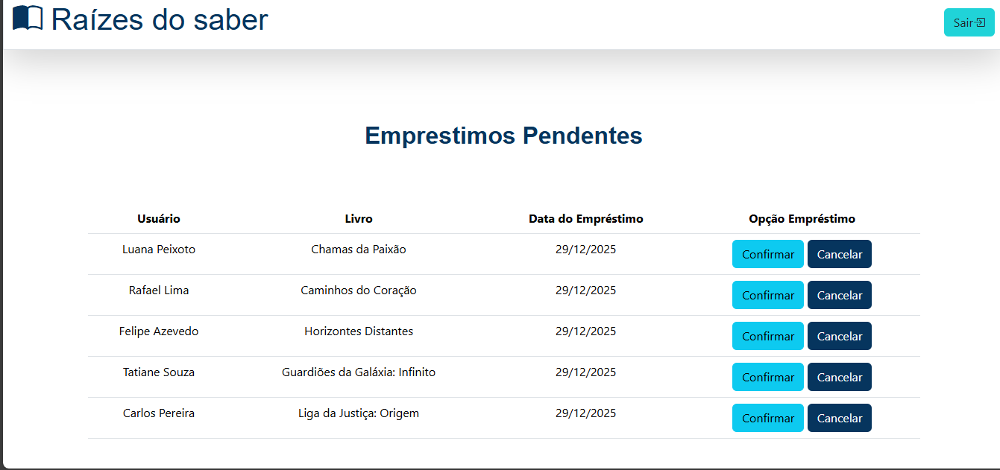

##  Funcionalidades

### Usuário

* Visualizar livros disponíveis
* Realizar empréstimo
* Visualizar livros emprestados
* Ateraçôes de nome e email

### Administrador

* Cadastrar livros
* Excluir livros
* Atualizar quantidade de livros
* Gerenciar empréstimos
* Ver empréstimos pendentes e confirmados


---

##  Screenshots do Sistema

> As imagens abaixo apresentam as principais telas do sistema e ajudam a compreender o funcionamento geral sem a necessidade de executar o projeto.

###  Tela de Login

Tela de autenticação para usuários e administradores.


### Dashboard do Usuário
Tela inicial após o login de usuário


###  Perfil do usuário

Tela responsável por mostrar os livros emprestados e o status que se encontra.



### Dashboard do Administrador

Área principal de gerenciamento do sistema, com acesso às funções administrativas.




###  Gerenciamento de Livros pendentes(adm)

Listagem de livros com emprestimos pendentes




---

##  Fluxo do Sistema

1. O usuário ou administrador realiza o login no sistema
2. O sistema valida as credenciais no banco de dados
3. O usuário visualiza os livros disponíveis
4. O usuário solicita o empréstimo de um livro
5. O administrador gerencia e confirma os empréstimos
6. O usuário realiza a devolução do livro pessoalmente
7. O sistema atualiza o status do empréstimo e a quantidade de livros

---

##  Como Executar o Projeto

1. Clone este repositório:

```bash
git clone https://github.com/seu-usuario/seu-repositorio.git
```

2. Coloque o projeto dentro da pasta do servidor local:

```bash
htdocs/ (XAMPP)
```

3. Crie o banco de dados no **phpMyAdmin** e importe o arquivo `.sql`

4. Configure a conexão com o banco em:

```bash
Dao/ConnectionFactory.php
```

5. Inicie o servidor Apache e MySQL

6. Acesse no navegador:

```bash
http://localhost/Projeto-biblioteca
```
7. OBS: O login de administrador é feito na mesma página de login de usuário com o email:adm@gmail.com e senha:admin@
---

##  Autor

**Claudemir Junior**
Estudante de Análise e Desenvolvimento de Sistemas
Em constante aprendizado em desenvolvimento web e backend

---
